# Multi-Style Canvas Workflow

AiMentor now returns multiple Elementor canvas layouts in a single run so editors can compare styles before committing to the canvas. The generator keeps rate-limit notices, provider metadata, and the canvas history carousel in sync with whichever variation is inserted.

## How it works

1. Launch the AiMentor generator from the Elementor widget panel or the modal trigger.
2. Choose **Page Layout** as the generation type and submit a prompt.
3. When the provider supports multi-style canvases, the result area renders cards for each variation.
4. Each card lists the variation label, a structural summary (sections/columns/widgets), and an **Insert this layout** button.
5. Clicking **Insert this layout** injects the variation into Elementor, records the choice in the canvas history, and updates the success banner in the card list.
6. The rate-limit notice stays visible after insertion so editors know when they can request the next batch.

## Tips

- Variation cards only appear for canvas requests. Content-only prompts continue to insert straight into the editor.
- The first card summary repeats above the grid with the green success badge so editors know the provider responded before choosing a layout.
- After insertion the selected card receives a green outline and the feedback message updates to confirm the layout entered the history carousel.
- The stored history entry combines the variation label with the layout summary so the carousel matches the variant the editor chose.
- Editors can immediately request another batch; the cooldown timer reflects the response payload from the provider that produced the variations.

## QA checklist

- [ ] Verify the AJAX response contains a `canvas_variations` array with decoded layout objects and metadata.
- [ ] Confirm variation buttons insert the correct JSON block into Elementor.
- [ ] After insertion, refresh the widget: the history carousel should list the selected variation with the combined label + summary.
- [ ] Ensure cooldown messaging in the modal updates with the last provider rate-limit payload even when multiple variations are returned.
